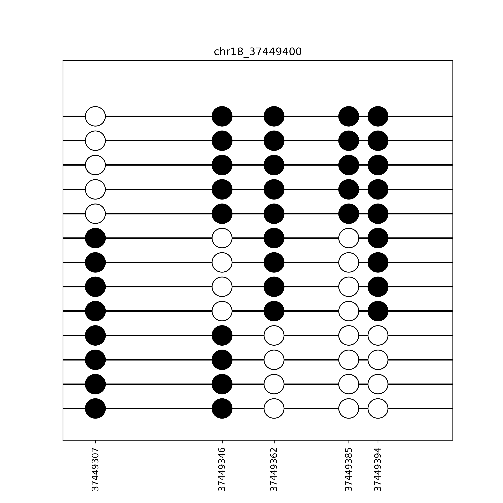

# CpGMatrixPlotter
package to plot CpG matrix data as circles spaces proportionally apart

## Plot example

This python package enables easy plotting of CpG data.

## Requirements
* Python3+
* Numpy
* Matplotlib

## Install
The package is not yet uploaded to PyPi so you must clone/download the repo first
1. Git clone or download and unzip the repo
2. Activate your virtualenv (Optional)
3. Navigate to the directory
4. Execute `pip install .` (note the period at the end)

## Usage
1. From within a jupyter notebook you can import the package like `from cpgPlotter import CpGMatrixPlotter`
2. Input data should be:
* 2D numpy array of 1s and 0s (ex `data = np.array([[1,1,1,0],[1,1,0,0]])`)
* 1D numpy array of CpG locations within a 100bp region (ex. `locations = np.array([100, 110, 155, 190]) `)
3. Instantiate an instance of the plotter `plotter = CpgMatrixPlotter()`
4. Pass the data to the plotCpGMatrix method of the plotter `plotter.plotCpGMatrix(data, locations)`
